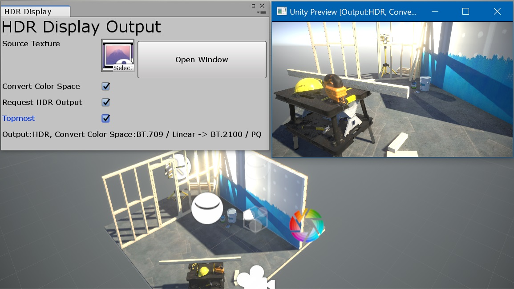

Unity HDR Display Output plugin
====

Copyright (c) Yasuhiro Taniuchi  

[LICENSE (MIT)](LICENSE)  
[Latest Release](https://github.com/aosoft/UnityHDROutputPlugin/releases/latest)  
[English](README.md)

## このプラグインについて

Windows 版 Unity Editor で Linear Color でレンダリングした RenderTexture を Windows 10 の HDR ディスプレイに HDR Color で出力、プレビューするものです。

HDR レンダリングした SDR 範囲を超える色は SDR ディスプレイでは色飛びをおこしますが、そのような映像も (理論的には) より正確な色で表示を確認することができます。

※このスクリーンショットは HDR でキャプチャされていないので本来の見栄えと異なります。

## 必要環境

* Unity 2018.2 (.NET Framework 4)
* Windows HD Color をサポートした環境 → [Windows 10 の HDR と WCG の色設定](https://support.microsoft.com/ja-jp/help/4040263/windows-10-hdr-advanced-color-settings)
    * Windows 10 Fall Creators Update (1709) もしくはそれ以降
    * HDR 出力をサポートした GPU
    * HDR10 対応ディスプレイ／テレビ
    * ディスプレイ設定で HDR を有効にする

プラグインとしては HDR 非対応環境でも SDR で出力できるようになっています。

## 使用方法

1. "Project Settings - Player" で下記設定にします。
    * Color Space を "Linear"
    * Scripting Runtime Version を ".NET 4.x Equivalent"
2. [最新版](https://github.com/aosoft/UnityHDROutputPlugin/releases/latest) から unitypackage をダウンロードしプロジェクトにインポートします。
3. RenderTexture を作成します。サイズは任意。 Color Format は "ARGB Float" か "ARGB Half" にしてください。
4. 3. で作成した RenderTexture に対してレンダリングが行われるように設定します。
    * Camera の TargetTexture に設定する。
    * スクリプトで任意のタイミングで描画するコードを記述する。
5. "Window - HDR Display Output" で設定ウィンドウを表示します。
6. Source Texture に 3. で作成した RenderTexture を設定します。
7. "Open Window" ボタンを押すとプレビューのウィンドウが表示されます。  
    アプリを実行していない時に開いていると実行開始時に閉じてしまいますが、再度ボタンを押して開いてください。

### オプション

* Convert Color Space  
    チェックすると表示するディスプレイに適した色空間 (色域、転送特性) 変換をします。チェックなしの場合は Texture の内容をそのまま表示します。通常は変換をするのが正しい映像になります。  
* Request HDR Output  
    チェックをすると出力先ディスプレイ (出力ウィンドウが表示されているディスプレイ) が HDR 表示可能だった場合、 HDR 表示をするようにします。  
    チェックされていない場合は HDR 可能でも SDR で表示します。
* Relative EV  
    プレビューの明るさを調整します。

## 使用時の注意

* 現時点では Direct3D 11 のみに対応しています。
* 多くの場合、最終的な出力映像ではトーンマッピングにより SDR に最適化した映像が出力されます。そのような映像はこのプラグインで HDR 出力をしても SDR で出力したものと同じ見栄えで表示されます。従ってこのプラグインを有効に利用するには SDR へのトーンマッピングを無効化する必要があります。
    * Post Processing Stack v2 のトーンマッピングを無効にするには Post Process Volume の "Color Grading" の設定を変更します。
        * Color Grading 自体を無効にする。
        * Mode を "None" にする。

## ライセンス

MIT License です。

"color.hlsli" は [Microsoft/DirectX-Graphics-Samples](https://github.com/Microsoft/DirectX-Graphics-Samples) からコピーして使用しています。

