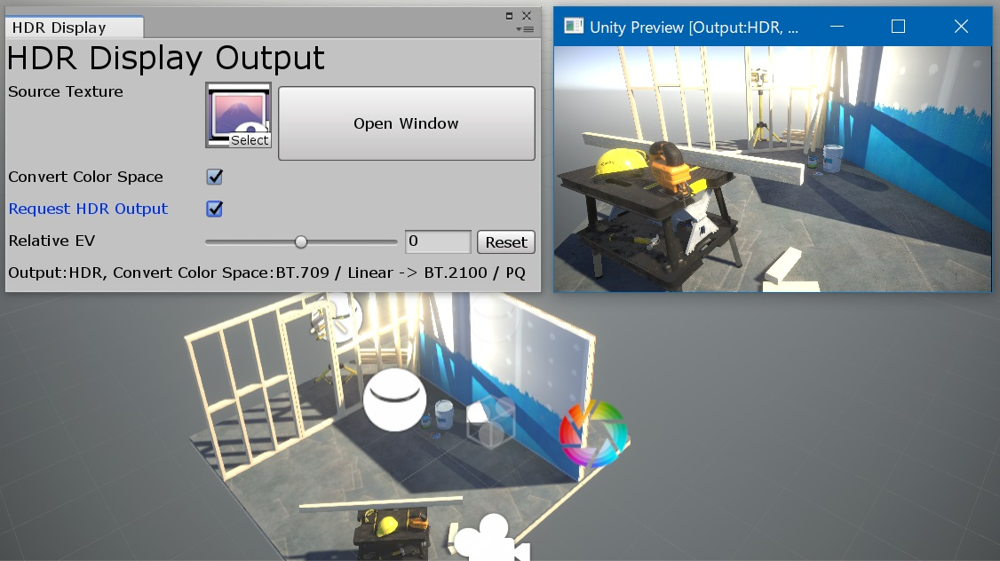

Unity HDR Display Output plugin
====

Copyright (c) Yasuhiro Taniuchi  

[LICENSE (MIT)](LICENSE)  
[Latest Release](https://github.com/aosoft/UnityHDROutputPlugin/releases/latest)  
[日本語](README.ja.md)

## About

This plugin is for previewing RenderTexture rendered with Linear Color on Windows 10 HDR display.

* This screenshot is different from the original display as it is not captured by HDR.

## Requirements

* Unity 2018.2 (.NET Framework 4)
* Support Windows HD Color -> [High Dynamic Range and Wide Color Gamut](https://docs.microsoft.com/en-us/windows/desktop/direct3ddxgi/high-dynamic-range-and-wide-color-gamut)
    * Windows 10 Fall Creators Update (1709) or later
    * GPU supporting HDR output
    * HDR10 compatible display
    * Enable HDR on display setting

It can be output with SDR even in non-HDR compatible environment.

## How to use

1. Setting with "Project Settings -> Player" .
    * Color Space - "Linear"
    * Scripting Runtime Version - ".NET 4.x Equivalent"
2. Download unitypackage from "[Latest Release](https://github.com/aosoft/UnityHDROutputPlugin/releases/latest)" and import it into the project.
3. Create RenderTexture. The size is arbitrary. Color Format is "ARGB Float" or "ARGB Half".
4. Set to render to RenderTexture.
    * Set it to TargetTexture of Camera.
    * Implement code to render with script.
5. Show the setting window with "Window - HDR Display Output".
6. Set RenderTexture to "Source Texture" .
7. Press the "Open Window" button to show the preview window.  
    If it is open when not running the application, it will be closed at the start of execution, but please press the button again to open it.

## Options

* Convert Color Space  
    * (checked) The color space (color gamut, transfer characteristics) suitable for display is converted.
    * (not checked) The contents of Texture are displayed as they are.  
* Request Color Space  
    Set the requested display color space. If the requested color space is not supported, it becomes sRGB.
* Relative EV  
    Adjust the brightness of the preview.

## Notes

* Currently, supported Direct3D 11 only.
* In many cases, images optimized for SDR are output by tone mapping. The same as the SDR output will be displayed even if you output that images to HDR. Therefore, in order to make effective use of this plugin, it is necessary to invalidate tone mapping to SDR.
    * ex) To disable Post Processing Stack v2 tone mapping, change the "Color Grading" setting of Post Process Volume.
        * Disable Color Grading itself.
        * Set Mode to "None".

## License

MIT License

"color.hlsli" is copied from [Microsoft/DirectX-Graphics-Samples](https://github.com/Microsoft/DirectX-Graphics-Samples) .
